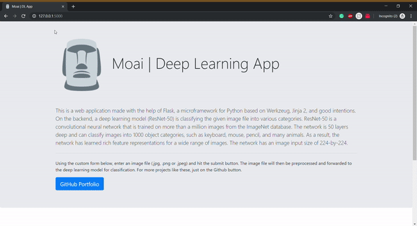

# :moyai: Moai | Deep Learning Application

This is a web application made with the help of Flask, a microframework for Python based on Werkzeug, Jinja 2, and good intentions. On the backend, a deep learning model (ResNet-50) is classifying the given image file into various categories. 

ResNet-50 is a convolutional neural network that is trained on more than a million images from the ImageNet database. The network is 50 layers deep and can classify images into 1000 object categories, such as keyboard, mouse, pencil, and many animals. As a result, the network has learned rich feature representations for a wide range of images. The network has an image input size of 224-by-224. 
  

Using the custom form, enter an image file (.jpg, .png or .jpeg) and hit the submit button. The image file will then be preprocessed and forwarded to the deep learning model for classification. For more projects like these, just on the Github button. 

